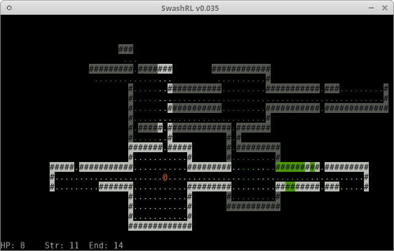

SwashRL
=======

Readme file, last updated 2020-03-20 19:29 CST  
Contact the maintainer: <swashdev@pm.me>

---

SwashRL is a Roguelike game currently in the early development phases.  The
actual "game" part is not yet functional, as it's still in need of a few
important pieces.

As the software is still under development and has not seen an official
release, it currently has NO DOCUMENTATION, save for that mentioned in this
file.

SwashRL currently has git respositories hosted at the following locations:

* <https://github.com/swashdev/SwashRL>

* <https://repo.or.cz/SwashRL.git>

* <https://github.com/swashdev/swash-tentative> (an additional repo used for
  sketches and note-taking)

If you're reading this Markdown file in a text editor or other program that
doesn't display hyperlinks, links to files or web pages referenced in this
document can be found at the bottom.

## Table of Contents

* [License Agreement](#license-agreement)

* [Supported Systems](#supported-systems)

* [Compiling](#compiling)

  * [Accessibility Options](#accessibility-options)

  * [Compiling for Derivatives](#compiling-for-derivatives)

* [Change Logs](#change-logs)

* [Contributing](#contributing)

* [Careware](#careware)

## License Agreement

SwashRL is released under [the BSD 3-clause "New" or "Revised" License], a
simple open-source license which allows for free use in exchange for retaining
the original license with all source distributions and not misrepresenting the
authors as endorsing the software.

SwashRL uses some third-party resources to function.  For details, see
[the acknowledgement file] and the third-party licenses referenced therein.

## Supported Systems

SwashRL was originally written for Linux, and is currently only being
maintained for Linux.  Previously, development versions have also been
produced for Windows, but unfortunately I currently do not have access to a
Windows computer, and I can not support the game on systems which I do not
have access to.

If you'd like to become a volunteer maintainer for SwashRL on your system,
[contact me] and I might be able to add you to the GitHub repository as a
collaborator.

## Compiling

Starting with version 0.022, SwashRL has been programmed in D.  This means
you'll need [DmD] or some other D compiler, but if you also get [dub], the D
package manager, it will do a lot of your work for you including downloading
dependencies.

You can make some changes to how SwashRL is configured by editing the file
[config.d].  This file has a lot of comment blocks which explain how to
configure SwashRL.  These configuration settings will be interpreted in
[global.d].

To compile, navigate to the root folder (the same folder this readme file is
in) and type:

> `dub build`

You'll need to be connected to the Internet the first time you compile so that
dub can download the packages that it needs.

By default, SwashRL will compile with SDL.  However, you can also compile
with ncurses by using dub's `--config` flag, and even compile with _only_
ncurses, by using one of the following commands:

> `dub build --config ncurses`  
> `dub build --config ncurses-nosdl`  

You can also compile with PDCurses, which is compatible with Windows, using
one of the following commands:

> `dub build --config pdcurses`  
> `dub build --config pdcurses-nosdl`

If you're compiling from a git repository, your compiled SwashRL will include
the current commit ID when asked for its version number.  If you are _not_
compiling from a git repository, you'll have to edit [config.d] and set the
`INCLUDE_COMMIT` flag to `false`, otherwise it will not compile.

If you're not sure whether or not your source code is in a git repository,
check and see if there's a `.git` directory in this folder.  If there isn't,
you can get the up-to-date source repository from
[our GitHub page].

For more information about git, check out [the git website].

### Accessibility Options

At compile-time, certain features can be activated which allow for greater
accessibility in the program.

#### Dyslexia-Friendly Font

For the benefit of dyslexic users who find the default font difficult to
read, the [OpenDyslexic] Mono font has been included.  If configured to do
so, SwashRL will use this font for all SDL interfaces.  The font will also
be increased slightly in size to make it easier to read.

The easiest way to compile the program with this font activated is to add the
following line to the [dub.json] file:

> `"versions": ["dyslexia"],`

_Do not place this line inside one of the configuration sets_; it is better
to add it to the cluster of settings at the top of the file, so that the
dyslexia-friendly fonts will be compiled for all versions of the software.
Don't forget the comma!

If you would like to fine-tune this configuration option, you can instead
edit the `FONT` and `MESSAGE_FONT` variables in [config.d] and adjust the
font size with the `TILE_WIDTH` and `TILE_HEIGHT` options.

### Compiling for Derivatives

There are a few things to note if you want to use the SwashRL source code to
make your own game.  First of all, [the BSD 3-clause License] is very
permissive, and unlike the GNU GPL and other copyleft licenses you absolutely
can commercially exploit SwashRL without having to release your source code.
This is not an oversight; I have intentionally licensed SwashRL to allow you
to do this.  However, you _must_ retain all copyright notices, attribution
notices, etcetera.

Secondly, you'll have to change the name of the program.  I've made this very
easy to do.  It only requires two steps:

1. Edit the file [dub.json] so that the "name" field has been changed to the
   name of your executable file (i.e., instead of saying `"name": "swashrl",`
   it will say `"name": "yourname",`; do not include the `.exe`)

   1. You should also modify the "authors" and "copyright" fields to reflect
      your copyright information, and the "license" field if you choose to
      relicense it.  For more information about the dub.json file, see
      [the Dlang JSON file documentation].

2. Edit the file [global.d] so that the "NAME" enum will be the
   name of your program (i.e. instead of saying `enum NAME = "SwashRL";` it
   will say `enum NAME = "Your Game's Name";`)

Third and finally, be aware that SwashRL is not the only licensed product you
will be interacting with, and there are a few other licenses that you'll have
to comply with, as noted in [the acknowledgement file].

## Change Logs

For all of your change logging needs, see [changes.txt].  For those
interested, there's also a more in-depth history of the project being recorded
[on the website].

## Contributing

If you're thinking of making a contribution to the SwashRL project, first of
all thank you very much!  We now have [contribution guidelines] to help you
get started.

The best way to contribute to SwashRL is via [our GitHub page], where you can
follow the conversation and see where we need help.

## Careware

If you like the SwashRL project and would like to support me, you are
encouraged but not required to help me in a personal quest of mine by making a
donation to a nonprofit organization.  ForeGen is a medical resarch project
that is helping to study and put into practice regenerative medicine beginning
with the regeneration of amputated foreskins.  This approach to regenerative
medicine is not only a simple way to begin putting this research into
practice; it will also help men who had their genitals cut against their will
as children regain their genital integrity and help them cope with their lost
bodily autonomy by putting them back in control over their own bodies.  With
time this research can do a lot of good in the immediate sense, but can also
be expanded into bigger and better uses of this blossoming technology.

If you need further information on why this is important, I suggest visiting
the Doctors Opposing Circumcision website, where you will find a plethora of
information about why circumcision and other forms of genital cutting are
harmful, as well as resources on how to deal with the trauma that often comes
as a result of the procedure.  I encourage you to donate to them as well, as
they are doing good work.

Links to these organizations can be found below, and DOC also includes a page
where you can find similar nonprofit organizations in countries nearer to you.

NOTE:  I (Philip Pavlick) DO NOT REPRESENT, NOR AM I AFFILIATED WITH EITHER OF
THESE ORGANIZATIONS, AND I AM NOT RECEIVING ANY SPONSORSHIP FROM THEM.  THE
VIEWS EXPRESSED IN THIS LETTER ARE MY OWN AND DO NOT REFLECT THOSE OF ANY
OTHER CONTRIBUTOR TO THE SOFTWARE, NOR THOSE OF THESE ORGANIZATIONS NAMED IN
THIS LETTER.

* <http://www.foregen.org/>
* <https://www.doctorsopposingcircumcision.org/>

[our GitHub page]: https://github.com/swashdev/SwashRL
[the BSD 3-clause "New" or "Revised" License]: LICENSE.txt
[the BSD 3-clause License]: LICENSE.txt
[the third-party file]: 3rdparty.txt
[the acknowledgement file]: 3rdparty.txt
[an issue]: https://github.com/swashdev/SwashRL/issues/2
[contact me]: mailto:swashdev@pm.me
[contribution guidelines]: docs/CONTRIBUTING.md
[config.d]: src/config.d
[global.d]: src/global.d
[OpenDyslexic]: https://opendyslexic.org/
[dub.json]: dub.json
[changes.txt]: docs/changes.txt
[on the website]: https://swash.link/history/
[DmD]: https://dlang.org/download.html
[dub]: https://code.dlang.org/download
[the git website]: https://git-scm.com/
[the Dlang JSON file documentation]: https://code.dlang.org/package-format?lang=json
